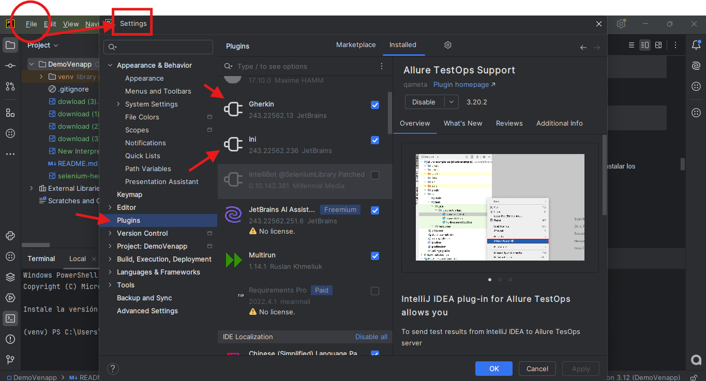

# Automatización de pruebas con Selenium, Behave y Python

Este proyecto se trata de una automatización de casos de pruebas bajo el framework selenium y Behave BDD, con lenguaje de programacion python, donde el objetivo principal es aportar un mayor rango de proyeccion de pruebas y agilidad en la ejecución de regresiones complejas, que amerite un mayor esfuerzo por parte del equipo de QA, de esta manera se puede priorizar los ojetivos del equipo enfocando las revisiones manuales sobre procesos puntuales, que sean de mayor prioridad de analisis y objetividad de enfoque

# Instalación de herramientas y proyecto

- [X] 😺 Descargar he instalar git https://git-scm.com/downloads, instalar según el SO que tenga en su equipo local

- [X] 🐍 Descargar de la web de python https://www.python.org/downloads/, instalar y asegurarse que esta correctamente isntalado python con el comando 🐍
    
        python --version

- [X] 🤖 Descargar de la web VERSION COMMUNITY de Pycharm: https://www.jetbrains.com/pycharm/download/, que sea la version community, se instalan y configuran. 🤖
- [X] ⬇️ Descargar el repositorio en la carpeta donde se alojara el proyecto en tu maquina local ejecutando el comando ⬇️

      git clone https://github.com/joscar39/DemoVenapp.git

- [X] 🔧 Luego sera necesario abrir el IDE (PyCharm, Visual Studio Code, etc) que ya fue instalado previamente, se deberá abrir con el IDE la carpeta del proyecto que se descargo a traves del comando git clone, y por ultimo para instalar todas las dependencias del proyecto sera necesario crear un nuevo interprete o entorno virtual "venv" de python, segun el IDE instalado se debe hacer lo siguiente 🔧: 
  ### ✅ Si instalaste PyCharm ✅
  Se hace directamente desde la opcion Add New Interpreter como se describe en la siguiente imagen

  

  ### ❌ Si No instalaste PyCharm ❌
  
  Deberás Instalar a traves de cmd la libreria virtualenv de python:
  
      pip install virtualenv

  Al tener instalado la libreria virtualenv, es necesario ir a la carpeta raíz del proyecto y ahí, crear el entorno virtual con el siguiente comando para asi tener configurado el entorno virtual correctamente:

      virtualenv venv
  

### Continuación de proceso de instalación de librerias y dependencias
- [X] 👨🏻‍💻 Instalar todas las dependencias del proyecto dentro del entorno virtual de python creado previamente, para eso es necesario; abrir una consla cmd e ir a la carpeta llamada Scripts dentro de la carpeta del entorno virual llamado ****venv**** que a su vez esta alojada en la carpeta raiz del proyecto, una vez dentro de la ruta de Scripts MyProyecto/venv/Scripts se deberá activar el entorno virtual con el comando 👨🏻‍💻

      activate

  Este comando hara que se visualice el prefijo ***(venv)*** seguido de la ruta de carpetas parecido a esto "****(venv) C:\MyProyecto\venv\Scripts>****" , de esta forma se garantiza que se activo el entorno virtual de python, acto seguido es necesario regresar a la raiz de la carpta ****venv****, para eso en la consola se debe ingresar el comando

      cd..

  Se quedaria en la reiz de la carpeta "****venv****" donde sera necesario correr el comando de instalacion de requirements alojado en la raiz del proyecto con el comando:

      pip install -r ruta_de_carpetas_hacia_la_raiz_del_proyecto/requirements.txt

  Culminado el proceso, desde la consola se desactiva el entorno virual con el siguiente comando para asi finalizar el proceso de instalación:

      deactivate

### Instalacion de Node.Js para utilizar allure report

- [X] 👨🏻💻 Instalar NodeJs y npm, ingresando a la web oficial de Node.js https://nodejs.org/, descargas la version LTS, abres el archivo descargado y sigue el asistente de instalacion 👨🏻💻 ☢️ IMPORTANTE: Se debe asegurar que se seleccione la opcion de "Ass to PATH" en el asistente de instalacion de Node.js, para  qe el path se configura automaticamente ☢️ Valida  que la instalacion de node y npm sea correctas usando los comandos en la consola cdm:

        node --version
        npm --version

- [X] 🚀 Instalar Allure CLI, esto se hace previamente teniendo Node.js y npm, se debe correr el siguiente comando para que se isntale globalmente de modo que se pueda usar el comando "***allure***"
 desde cualquier terminal 🚀

        npm install -g allure-commandline

    Validar que la instalacion sea exitosa ejecutando el comando:

            allure --version

### Instalacion de Plugins en IDE de Pychram

-[X] Desde el modulo Settings, ingresar a la sección Plugins e instalar los siguientes desde el marketplace:
  

    Gherkin
    ini

# 💻 Estructura del proyecto

El framework del proyecto es Selenium sumado con el lenguaje de programación python y la herramienta de desarrollo guiado de BDD Behave en lenguaje Gherkin, la reporteria está alimentada con la librerias de allure report behave para asi dar profundidas sobre las ejecuciones realizadas con el codigo automatizado.

Se Definio la siguiente estructura del proyecto haciendo énfasis en el uso de patron de diseño de pruebas POM (Page Object Model) el cual ayuda a organizar y estructurar el código de pruebas, mejorando su legibilidad, mantenibilidad y reusabilidad.

De tal forma que la estructura designada es de la siguiente manera:
1. (****web****): Carpeta que contiene una clase que instancia otras clases de los pages object model, que serán usadas como objetos de la propia clase application en diversos steps definition.

2. (**configurations**): carpeta que contiene un archivo de configuración general del proyecto.

3. (**features**): Carpeta principal que contiene la estructura del framework behave y acompañado del modelo POM, donde se encontraran sub-carpetas como:
   - (**pom**):sub carpeta de feature, que contiene el page object modal, donde se encuentra todo el modelado de objetos desglosados por páginas las cuales a su vez están confirmadas por funciones que permiten ejecutar una o varias acciones en una misma funcion
   - (**steps**): sub carpeta de feature, la cual sirve para desarrollar los steps que contiene cada feature planteado como escenario.
   - (**tests**): sub carpeta de feature, que almacena todos los features que continen steps (pasos) que conforman un caso de prueba.            
   - (**environment.py**): Archivo que contiene el hook para inicializar y finalizar cada escenario ejecutado.
 
4. (**support**): contiene archivos de soporte sobre metodos y funciones utilizados en el codigo.     
   - BaseActions.py: Archivo que contiene todas las acciones globales del proyecto, creados en métodos que serán instanciados por las diferentes funciones de Page.    
   - Exceptions.py: Archivo con clase de exceptions personalizados que permitan dar mayor precision en la información de errores detectados
   - CreateDriver.py: Archivo que crea la instancia del driver o manejador web que será utilizado por el proyecto.
   - WebDriverFactory.py: Archivo que construye la instanciación de la libreria webdriver-manager, la cual permite levantar el navegador según la data configurada para el proyecto desde la carpeta config.py.
   - GeneralLocator.py: Archivo donde se alojan las clases que alojan los objetos de tipo localizadores distribuidos por page.
5. (**requirements.txt**): Archivo que contiene las dependencias y librerias necesarias para ejecutar el proyecto.
6. (**behave.ini**): Este archivo permite personalizar el comportamiento de Behave y definir opciones específicas para la ejecución de las pruebas.

# Ejecutar y Construir reporte allure

Es necesario para ejecutar los test que se abra una consola terminar bien sea desde el mismo IDE

Los comandos a utilizar para correr los test segun la necesidad del usuario son:

Para correr todos los features creados:

      behave --no-skipped --no-capture

Para correr un solo feature en específico:

      behave '.\features\tests\01Login' --no-skipped --no-capture

Para Correr un grupo de pruebas bajo una etiqueta o decorador previamente definido (regression, smoke, integration, test, etc) se debe ejecutar:

      behave --tags=<Nombre del decorador o etiqueta usado> --no-skipped --no-capture

* Nota: las etiquetas que están creadas en el proyecto son:
    *   @test1: Escenario de login exitoso
    *   @test2: Escenario de login fallido
    *   @test3: Busqueda de productos
    *   @test4: Agregar producto al carrito
    *   @test5: Validar total del carrito

El comando final para ejecutar los test bajo etiquetas es:

        behave --tags=@test1 --no-skipped --no-capture

Generar el reporte Allure, se debera ejecutar en la terminal del proyecto:

      allure serve allure-results/

Plugins a instalar en PyCharm

  - Gherkin
  - ini

Plugins a instalar en VisualStudio Code

  - Python
  - Gherkin